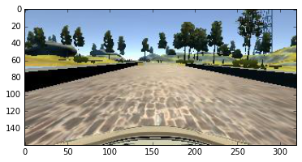
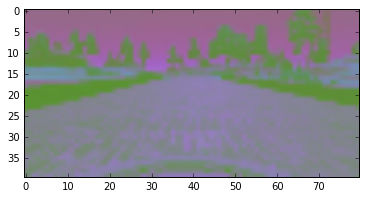
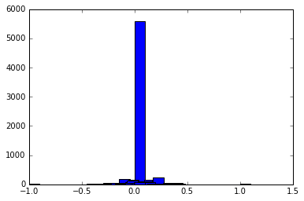

# Behavioral Cloning Project 

## Overview
A convoluted neural network was use to create a model that can predict the steering angle of a car going around a track in a simulator. The model was trained on over 10,000 recorded 'center images' and 'steering angles' taken from a car being manually steered around a track. An image generator was used to increase the amount of data. This resulted in the model taking in an image of the track as the car moved forward and predicting the steering angle for the next frame. The car successfully completed a lab a round the track autonomously. 

---

There are **2** python scripts: **model.py**, and **drive.py**.

## model.py
This python script includes preprocessing and model creation, compiling and fitting the data to the model.

### Preprocessing
The preprocessing started with reading in data from a csv file into a pandas dataframe.

The images were converted from bgr to YUV.
I resized the images to decrease the number of pixel to computation time. I decrease the images size from 320 by 160 by 3 to 80 by 40 by 3. This reduced the training time greatly, from 153,600 pixels to 9600 pixels per images. 

Below is an original center image followed by YUV convert and resized image.


```python
    dataframe = pandas.read_csv('driving_log.csv', header=0)
    dataset = dataframe.values
    center_img = dataset[0,0]
    print(center_imgs)
    center = mpimg.imread(center_imgs)
    plt.imshow(center)
    
    
```

    IMG/center_2016_12_01_13_30_48_287.jpg


    <matplotlib.image.AxesImage at 0x1282a8860>





```python
    center= cv2.cvtColor(center_img, cv2.COLOR_BGR2YUV)  
    plt.imshow(cv2.resize(center, (IMG_WIDTH, IMG_HEIGHT )))
```


    <matplotlib.image.AxesImage at 0x126efa940>





These processed images were saved as **features** the steering angels data was saved as **labels**.

I had trouble normalizing the data at first. I did not feel that "image/=255" followed by "image-= 0.5" were normalizing each of the 3 values of the YUV but normalizing every value in the entire array. Therefore I explored the the YUV data structure and split it, flattened it, normalized it and reshaped it back the the original dimensions. As you can see in normalization code a few normalization methods were tried. I pick the simplest so it could be preprocess the image data in drive.py quickly and it gave good results. 

I split the data into **X_train, Y_train** and **X_valid, Y_valid**.

### Model Creation, Compiling and Fitting

My model was based on the NVIDIA model. I used fewer layers and I made my image smaller to save processing time. Also, since my image started out smaller I need to change some of the boarder_mode values to 'same' from 'valid'.
This is because the output feature maps form a layer with 'valid' boarder_mode are smaller than the input feature maps. This resulted in an output feature map smaller than the next patch size, so I changed 'valid' to 'same'. 


The first 3 layer have a patch size of 5 by 5 and the last convnet layer has a patch of 3 by 3. This traverses the images connecting each patch to a neuron. The number of filters increases by convnet layer(24,36,48,64). There is more than one filter so many different characteristics can be identified. The increase in filters for each convnet layer decreases the dimensionality and increases the depth. After each convnet layer there is a 2 by 2 maxpooling layer. This reduces the size of the next input layer and prevent over fitting. All layer had 'relu' activation.

(W−F+2P)/S+1 is the formula for calculating the dimensions of the next layer where W is the volume of the input layer, F is the volume of the filter, P is the padding and S is the stride.

A summary of the model is illustrated below:

I initially started with a branched convnet but at the time I had problem with getting it to work with drive.py because the branched model takes two inputs. This would have never worked with processing time.

Overfitting was reduced with a 10% dropout layer after the data was flattened. 
This was followed by 5 fully connected dense layer with 'relu' activation.
Over fitting was reduced by a 10% dropout layer after the fourth dense layer.

### Data set and training
At first I created my own training data by steering and accelerating with my up, down, left, and right keys. The had bad results after many tries. I then used the Udacity provided 'trainable data'. With this data the car did not make it around the track at first. With some retraining of the problem areas the car did make it around the track, weaving at spots, but it made it. I made copies for the files and tried to impove again and again but only mad it worse. These are the saved files.

I tried center, left, right image angles but it was taking very long time to process so I went back to center image angle only.


```python
____________________________________________________________________________________________________
Layer (type)                     Output Shape          Param #     Connected to                     
====================================================================================================
convolution2d_5 (Convolution2D)  (None, 36, 76, 24)    1824        convolution2d_input_2[0][0]      
____________________________________________________________________________________________________
maxpooling2d_4 (MaxPooling2D)    (None, 18, 38, 24)    0           convolution2d_5[0][0]            
____________________________________________________________________________________________________
convolution2d_6 (Convolution2D)  (None, 14, 34, 36)    21636       maxpooling2d_4[0][0]             
____________________________________________________________________________________________________
maxpooling2d_5 (MaxPooling2D)    (None, 7, 17, 36)     0           convolution2d_6[0][0]            
____________________________________________________________________________________________________
convolution2d_7 (Convolution2D)  (None, 7, 17, 48)     43248       maxpooling2d_5[0][0]             
____________________________________________________________________________________________________
maxpooling2d_6 (MaxPooling2D)    (None, 3, 8, 48)      0           convolution2d_7[0][0]            
____________________________________________________________________________________________________
convolution2d_8 (Convolution2D)  (None, 3, 8, 64)      27712       maxpooling2d_6[0][0]             
____________________________________________________________________________________________________
flatten_2 (Flatten)              (None, 1536)          0           convolution2d_8[0][0]            
____________________________________________________________________________________________________
dropout_3 (Dropout)              (None, 1536)          0           flatten_2[0][0]                  
____________________________________________________________________________________________________
dense_6 (Dense)                  (None, 1024)          1573888     dropout_3[0][0]                  
____________________________________________________________________________________________________
dense_7 (Dense)                  (None, 100)           102500      dense_6[0][0]                    
____________________________________________________________________________________________________
dense_8 (Dense)                  (None, 50)            5050        dense_7[0][0]                    
____________________________________________________________________________________________________
dense_9 (Dense)                  (None, 10)            510         dense_8[0][0]                    
____________________________________________________________________________________________________
dropout_4 (Dropout)              (None, 10)            0           dense_9[0][0]                    
____________________________________________________________________________________________________
dense_10 (Dense)                 (None, 1)             11          dropout_4[0][0]                  
====================================================================================================
Total params: 1776379
```

The below image demonstrate counts of different steering angles. This data is the provided 'trainable data' plus some training of problem areas by me on my keyboard. Previously when I created all the training data myself with the keyboard mostly all values were at zero with a few values visible at 1 and -1. Training with the keyboard was a problem for me.


```python
import matplotlib.image as mpimg
import collections
%matplotlib inline

label_count = collections.Counter(labels)
labels2, values = zip(*label_count.items())
indexes = labels2
width = 0.1
plt.bar(indexes, values, width)
plt.show()
```





I used an Adam optimizer with a learning rate of 1e-5.  Then to fine tune after the retaining of the problem areas I us a learning rate of 1e-4. 

I needed more input data. I felt like the keyboard steering was messing up the training data so at the last minute I used a image generator and a fit generator to handle the load.


The resulting model and weights are saved as **model.json** and **model.h5**.

## drive.py
This is the script that is given an image by the simulator in autonomous mode and it uses the model to predict an angle and apply it to the next image.

These images were preprocessed by converted to YUV, resized and normalization  same way as the training data.

## Conclusion

In conclusion this was a 'hands on' implementation of behavioral cloning with a convolutional network. Image data and steering data was obtained from a simulator and use to train a convolution neural network. The model was used to predict the steering angles of images. These angles were used to successfully steer the car around the track autonomously. 

A point for further exploration is the incorporation of speed into my predictive algorithm. I think training at one speed and testing at a different speed is problematic. The same correction at low speed will require a shaper angle than at a high speed. So adding a branch to the model inputting speed I believe would improve the model. 


```python

```
